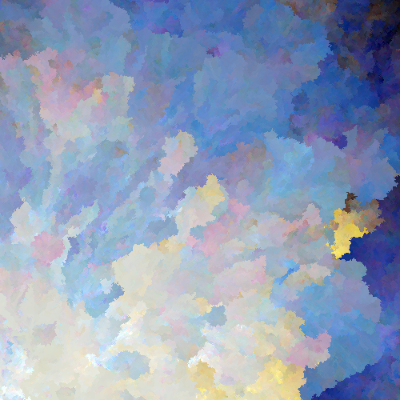

# Pix

Turn photos into abstract art.



Install the command-line tool with `go get`:

```
go get -u github.com/yurivish/pix/cmd/pix
```

Run it like so:

```
pix -in picture.jpg
```

Generate multiple outputs by sweeping the parameter space:

```
pix -in picture.jpg -sweep
```

Pix is capable of generating 8,000×8,000 outputs in around a minute. 

The pixel-placement process is inherently serial and performs one nearest-neighbor search per output pixel, so the time taken depends significantly on the placement order and color distribution since those affect the size of the dynamic search tree and the shape of the frontier. 

When the `-sweep` or `-variations` flags are used, variations are generated in parallel.