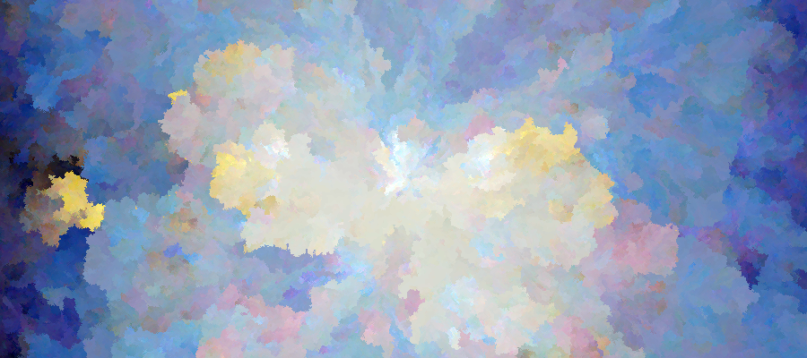

# Pix

Turn photos into abstract art.

The command-line tool can be installed with `go get`:

```
go get -u github.com/yurivish/pix/cmd/pix
```

and run like so to sweep the prameter space:

```
pix -in picture.jpg -sweep
```